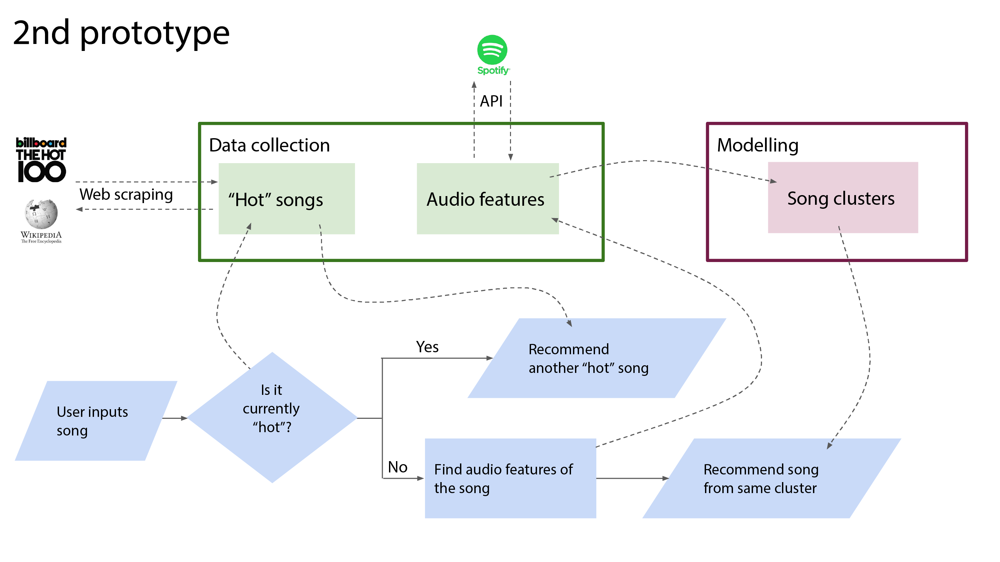
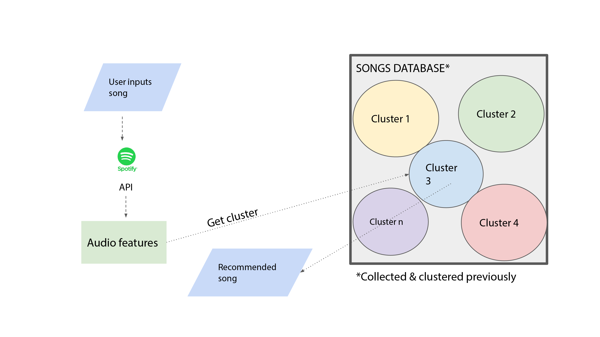

*Nicolás M. Japas*

## Content
- [Project Description](#project-description)
- [Hypotheses / Questions](#hypotheses-questions)
- [Dataset](#dataset)
- [Cleaning](#cleaning)
- [Analysis](#analysis)
- [Model Training and Evaluation](#model-training-and-evaluation)
- [Conclusion](#conclusion)
- [Future Work](#future-work)
- [Workflow](#workflow)
- [Organization](#organization)
- [Links](#links)

## Project Description
The goal of the project was to build a song recommender using Spotify API sound features, KMeans clustering and web scraping with Beautiful Soup.
The user inputs a song's title and then the script returns a new song which matches it's acoustic characteristics.

## Hypotheses / Questions
* How to make use of algorithms to cluster songs based on acoustic data?
* How to compare and match a particular song with others?

## Dataset
* The data was obtained by scraping with Beautiful Soup and by using the Spotify API to fetch thousands of songs from the Spotify playlists.

## Cleaning
* Some cleaning required as not all the songs have complete feature information.
* Also several duplicates due to the nature of playlists.

## Analysis

## Model Training and Evaluation

## Conclusion
* I was able to generate recommendations based on the selected features.
* The number of clusters selected could be higher. More data or features probably needed.

## Future Work
* The project could be upscaled and refined. The features may not be all relevant.
* Implementing an interface could be interesting.

## Workflow

## Links
https://github.com/nicojapas/spotify_songs_recommender

